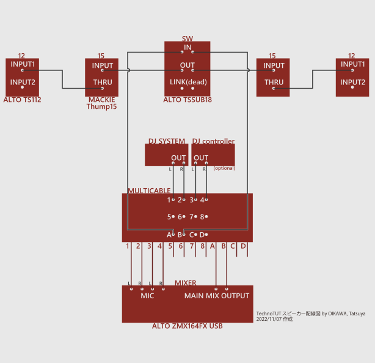

# Audio Setup for DJ Live Event
Last update: 2023/3/4 by OIKAWA, Tatsuya
## 概要
ここではDJイベントで使う音響機器の配線と設定を示す。
  
FIGURE 1 Audio setup for DJ live event.

---

## 配置、配線
スピーカー、マルチケーブル、ミキサー筐体を配置する。電源やケーブルはまだ接続しない。
この配置はイベントごとに異なるので、責任者に確認。

一般には、DJ機器、スピーカー、マルチケーブルをステージ側、ミキサーを対面後方(客側)に置く。サウンドチェックを円滑にするためである。

配置が終わったら、FIGURE 1のように配線する。このとき各機器の電源はOFF、かつVOLUMEやGAINはゼロにしておく。抜き差しした箇所や端子によってはスピーカーにダメージが行く可能性がある。

配線が終わったら、各機器の電源を入れていく。順番は必ず以下の通りに。
1. ミキサー
2. DJシステム
3. SW
4. 15
5. 12

## 設定
電源を入れたら、各機器のVOLUMEやGAINを上げていく。DJシステム上で何か曲を流しながら、ゆっくりと上げていくとよい。上げる機器の順番は任意だが、急に大音量が流れることのないように。心臓がもたない。

音量の基準は、ミキサーは+2を超えないように。DJシステムは責任者に確認。DJはそれを超えないように、曲ごとにGAINを調節しながらプレイする。曲のGAIN調整はDJの命。

【任意】音量調整ができたら、ミキサー上のイコライザで周波数特性を調整する。高音、中音、低音それぞれがはっきり聴こえる状態を目指す。色々なジャンルの音楽を流しながら調整したい。DJ陣の音出しを兼ねてもよい。

## 付録: 各機器詳細

### SW | ALTO TSSUB18
https://inmusicbrands.jp/alto-pro/tssub18/

出力: 600 W RMS, 1200 W peak

周波数特性: 37-125 Hz

LINK: INをそのまま出力する。死んでて使えない

OUT: INを80 Hzでハイパスして出力

### 15 | MACKIE Thump15
https://www.soundhouse.co.jp/products/detail/item/245747/

出力: LF 400 W RMS, 800 W peak; HF 100 W RMS, 200 W peak

周波数特性: 32-23000 Hz @ -10 dB, 39-20000 Hz @ -3 dB

### 12 | ALTO TS112
https://inmusicbrands.jp/alto-pro/ts112a/data/ALTO_TS112A_jp_web.pdf

出力: 400 W RMS, 800 W peak

周波数特性: 52-18000 Hz

以上