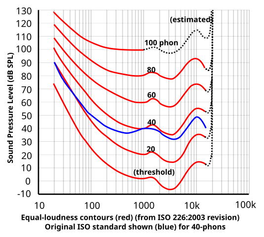
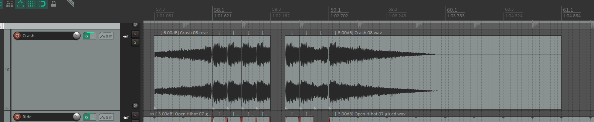

# Akaichi流DTM論 - 振幅軸・周波数軸・時間軸の話
## 兼 TechnoTUT Advent Calendar 2024 4日目
Last update: 2024/12/03 by Akaichi

### おことわり
アドカレを兼ねていながら，完全にDTMer向けとなっており，DTMに興味ない方を置いてけぼりにしている可能性があります．
しかも，アドカレらしさは微塵もないです．技科大のアドカレが4つもあるし，みなさんテストあったりで，枠埋まらないかもなと思い，雑に2枠も埋めてしまった…

あと公開日時の設定がようわからんので，このページも[**明日の分（実践編）**](../zissenhen/zissenhen.md)も，ちょっとだけ早めに閲覧できちゃうと思います．
日付来る前に読んじゃうかはお任せします．~~アドカレってなんだっけ？~~

---

## 序論
ミックスにおいて「この音をもうちょっと聞こえるようにしたい！」と思ったとき，大抵はその音量をフェーダーとかで上げることを考えると思います．
そしたら別の音が聞こえにくくなって，それをあげたらまた別の音が…みたいな．特にDTM始めたての方などは，なりがちなのかなと思います．
このページでは，その無限ループの解決策になるような感じかなと思います，多分

## 振幅軸の話
まずはいちばん直感的であろうところから．でも意外と難しかったりします．
振幅の話をするにあたって，ひとつ知っておいてほしい概念が，「Peak」と「RMS」と「LUFS」ですね．ざっくり説明↓
* Peak
	* データ的な瞬間最大値．「True Peak(TP)」とかもあるが，とりあえず「まあ似たようなもん」でいいかな
* RMS
	* 音のエネルギー的な平均．時間は300msだったり600msとかだったりファイル全体だったりまちまち．「VU」も，「まあ似たようなもん」かな？
* LUFS
	* より人間の感覚に近い音量．ラウドネスとも．時間は，400ms / 3s / ファイル全体 の3種類．

（ちょい語弊なんですが飛ばします…）

あと単位のdBは対数なのも注意です．音量2倍 ≒ 6dB

 
作った曲をマスタリングして書き出すとき，Peakは0dBを超えることはないです．2mixの状態の音量をどんだけ上げてもリミッターとかで潰されます．
そんでLUFSも大体上限があります．LUFSの稼ぎ方もいろいろあるけどそれは[**実践編**](../zissenhen/zissenhen.md)で．

テキトーに音を重ねるだけだと音圧感は下がってしまいます．

「キックができるだけデカい曲を作りたい！」ってなったとき，どうすればよいかというと，キック以外の音を入れなきゃいいんですね．これはバカなようで割と真理．

んでキックをデカくしつつ，他の音を入れたいときは， **「ダッキング」** しましょう．これまじでクラブ系の曲作るなら必須テクです（n回目）．
具体的なやり方は[**実践編**](../zissenhen/zissenhen.md)で．

## 周波数軸の話
ちょっとDTMの勉強をしようとなったとき，大抵最初のほうに音域・帯域のことが出てくるかなと思います．
帯域かぶってると「マスキング効果」でよく聴こえないからカットしよう，みたいな．

ここでのちょっと注意点は，「**音域≠帯域**」です．混同してる人が割といるんじゃないかなと思います．

キックとかベースは，音域は40～80Hzくらいの低いとこにありますが，1kHzとか，なんなら10kHzくらいの高周波帯域も含んでることも普通にあると思います．
そしてむしろ聞こえやすさという点ではこの高周波帯のほうが重要まであります．

ボーカルの音域はざっと200～600Hzくらいでしょうか．でも子音がいろんなとこに分布していて，k音が1kHzを含んでいたり，s音が5kHzを含んでいたり（あくまで一例）．

音程を強調するなら音域の周波数帯を，アタックや空気感などを強調したい場合はそれらに対応する周波数帯が出るようにしてやらないといけないということです．

 
で，EQでブーストすることばかり考えがちかと思うんですが，基本的にEQは「いらない部分をカット」が主体のほうが破綻しにくくていいと思います．
とりあえずローカットはほぼ全楽器やっときましょう．単体で聴いて，「ちょっと薄いかな？」と思ってもミックス全体で聞くとちょうどよかったりします．

帯域というより音域がかぶってるときは，EQじゃなくて，音程をオクターブ上げ下げしたり，コードの「ボイシング」を変えたりしたほうが効果的だったりします．
あとキック・スネア・タム類も大体音程があるので，曲の調を邪魔しないように±1半音とかしたほうがよかったりする場合もありますね．
それにちょっと関連して，同時に鳴ってる音程は4つか5つくらいまでが必要十分って感じだと思います．Akaichiはめっちゃ気にしてます．

 
あと周波数に関して知っておきたい概念が，「等ラウドネス曲線」です．振幅軸の話で出てきたLUFSにも関係しますね．

等ラウドネス曲線（出典：https://commons.wikimedia.org/w/index.php?curid=2565926 ）

 
このグラフの見どころは，
* 重低音は振幅・エネルギーの割に聞こえにくい（小音量では特に）
* 3kHzあたりがいちばんうるさく，耳に刺さる
* 1.3kHzあたりと7k～12kHzあたりはちょっと上げても耳に刺さらない

って感じです．

## 時間軸の話
音の前後をつくりたいとき，コンプで潰したりブーストして前に…と考えがちかと思います．

ここで問題です．音源からの距離が変わると何が変わるでしょうか？
遠くなるほど音質が丸くなるももちろんそうなんですが，**時間も遅れますよね**．

では，1m距離が遠くなるとどれくらい音は遅れるでしょう．

音速は約340m/sですから，**1mあたり約3ms**の遅れとなります．DTMでmsって単位をよく見てると，意外と大きいと感じませんか．

Akaichiはメインボーカルに対してコーラス（字ハモ）は大体5～10msくらい遅らせています．
特にSynthVとか使ってるとタイミングぴったりすぎになりがちなので，このテクは効果的です．
もちろんぴったり張り付いたようなコーラスも全然ありだけど．

 
また，時間軸はリズムにも関わってきます．
ドラムサンプルの長さや，各楽器のサステインやリリースの長さにより，ノリが変わります．
リズムは音の立ち上がりだけじゃなく，その減衰の仕方や，立ち下がりのタイミングでも感じることができます．

特に現在はダイナミクスが大きいほうが好まれる傾向にある気がするので，音を止めてメリハリをつけることが重要な気がしてます．

Akaichiはクラッシュとかの音の切れる場所を拍に合わせることが多いです．あとこういうのとか↓

[**▶音を再生**](crash_choke.mp3)

音ゲーcoreあるある

 
以上です．
わかりにくい点や，詳しく知りたいこと，意見・感想などありましたら[**X（旧Twitter）**](https://x.com/Mananan722)でも対面でもいいのでぜひ．多分Akaichiが喜びます．

---
